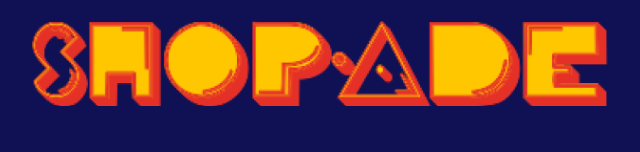
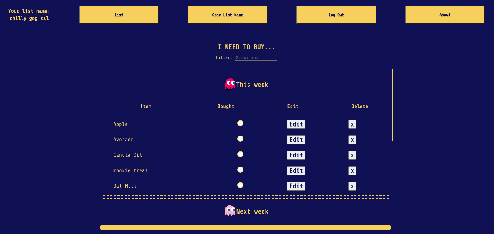
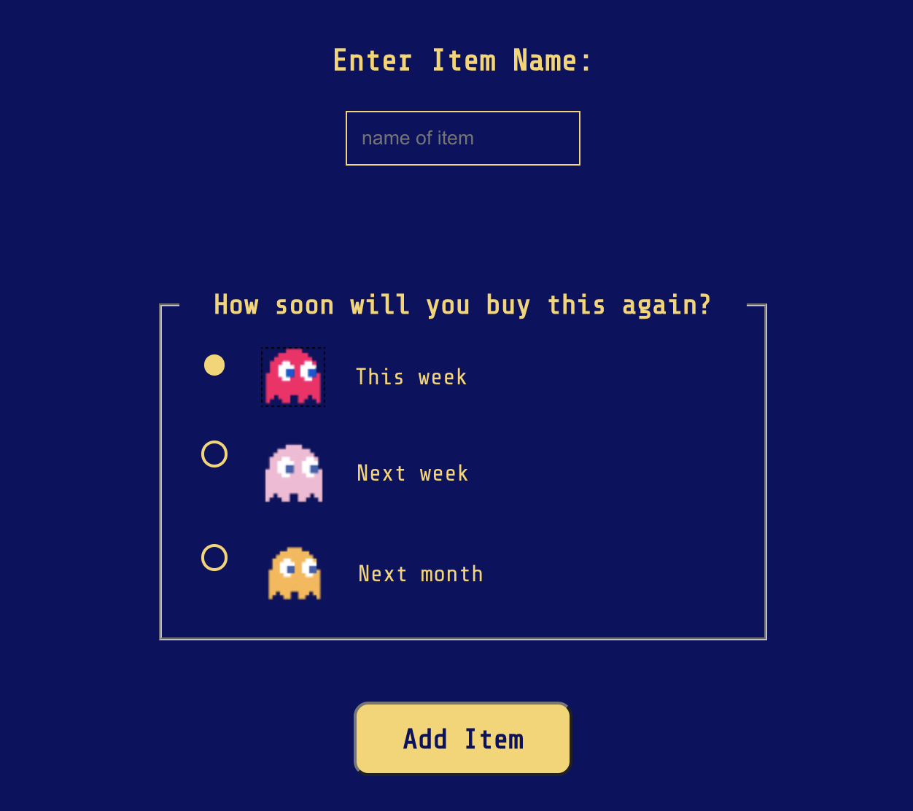

[Click here to check it out!](https://tcl-45-smart-shopping-list.firebaseapp.com/)

<h1 align="center">
     Shop-Ade  
    
</h1>

Shop-ade is a retro arcade Pacman themed smart shopping list app that learns your buying habits and predicts the next time you may buy items.

<h2 align="center">
     How this app is used:
    
</h2>
 

A user may enter the app with their personal token or input a shared token. A list of items in order of when it may be next purchased is displayed.

 

A user may also add an item and choose the time frame in which they may buy the item next so that the app can begin its predictions.

 

And that's it, happy shopping! 
    
    
    

<h2 align="center">
     Team Members 
    
</h2>
 

### Michelle Nygren

[LinkedIn](https://www.linkedin.com/in/michellenygren/) [GitHub](https://github.com/michellerenehey) [Portfolio](https://www.michellenygren.dev/)

### Mira Kinebuchi

[LinkedIn](https://www.linkedin.com/in/mira-kinebuchi/) [GitHub](https://github.com/mira-kine)

### Nadia Zubko

[LinkedIn](https://www.linkedin.com/in/nadezhda-zubko-developer/) [GitHub](https://github.com/N-Zubko) [Blog](https://n-coding.hashnode.dev/)

### Trevor Rezac

[LinkedIn](https://www.linkedin.com/in/trevor-rezac/) [GitHub](https://github.com/Trevor-Rezac)

### Mentors

[Lindsey Dinkel](https://www.linkedin.com/in/lindsey-dinkel/)
[Zenzi Ali](https://www.linkedin.com/in/zenziali/)
[Nick Taylor](https://www.linkedin.com/in/nickytonline/)

<h2 align="center">
     Languages, frameworks, tools used:
    
</h2>

- React
- React-Router-Dom
- React-hot-toast
- Modular CSS
- Firebase
- Cloud Firestore
